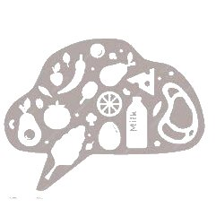

# MealMind Backend🥗🍛

### Team Members

- Fatema Aljonaid - [Github](https://github.com/Fatema-J) | [Linkedin](https://www.linkedin.com/in/fatema-aljonaid/)
- Hawraa Alattar - [Github](https://github.com/hawraalattar) | [Linkedin](https://www.linkedin.com/in/hawraalattar/)
- Jenan Alawadhi - [Github](https://github.com/jenanalawadhi1) | [Linkedin](https://www.linkedin.com/in/jenan-alawadhi/)

---

### Overview



**_MealMind_** is an innovative web application designed to create personalized diet plans for users. By leveraging artificial intelligence, the app tailors meal recommendations based on user responses to a questionnaire. Whether you’re aiming for weight loss, muscle gain, or overall health improvement, our app has you covered.

---

### Key Features

1. Personalized Plan
2. Publish and Share
3. Community Interaction

---

### Getting Started

1. Clone both [backend](https://github.com/Fatema-J/MealMind-backend) and [frontend](https://github.com/jenanalawadhi1/MealMind-FrontEnd) repositories.
   - `git@github.com:Fatema-J/MealMind-backend.git`
   - `git@github.com:jenanalawadhi1/MealMind-FrontEnd.git`
2. Install dependencies for each app (`npm install`).
3. Set up your MongoDB database.
4. Create .env file in the backend repository contains these varaibles

```
MONGODB_URI=<connection to mongodb>
APP_SECRET=<random String>
SALT_ROUNDS=<Number>
GROQ_API_KEY=<api key for groq>
```

5. Run the front-end and back-end servers.
6. Access the app locally.

---

### Technologies Used

- Front-end: **React**
- Back-end: **Node.js, Express.js, MongoDB**
- Project Management: **Trello, Slack**
- Designing Phase: **Canva**
  - [component hierarchy diagram](https://www.canva.com/design/DAGHxAJo_jw/vXaIVxrFJjrdfCSdMPg1ng/edit?utm_content=DAGHxAJo_jw&utm_campaign=designshare&utm_medium=link2&utm_source=sharebutton)
  - [wireframe](https://www.canva.com/design/DAGHwsnK8KQ/zjGfQ2WnddJBScql7dDwhg/edit)
  - [ERD](https://www.canva.com/design/DAGHw-wdAdw/ciKQi4I4dDn5z2gQ7BjbNw/edit?utm_content=DAGHw-wdAdw&utm_campaign=designshare&utm_medium=link2&utm_source=sharebutton)

---

### Deployment and Live Demo

- [Link to deployed site]
- [Trello board](https://trello.com/b/eIbm4xlp/mealmind)
- Screenshots:
  
  

---

### Additional Features

- [ ] Dark Theme
- [ ] Different plan categories (Vegan, Keto, Gluten-free.. etc)
- [ ] Upload image for the post

---

### Credits

- [chatgpt](https://chatgpt.com/) to engineer our prompts for the API
- [groq](https://groq.com/) the AI api to generate customized plans
